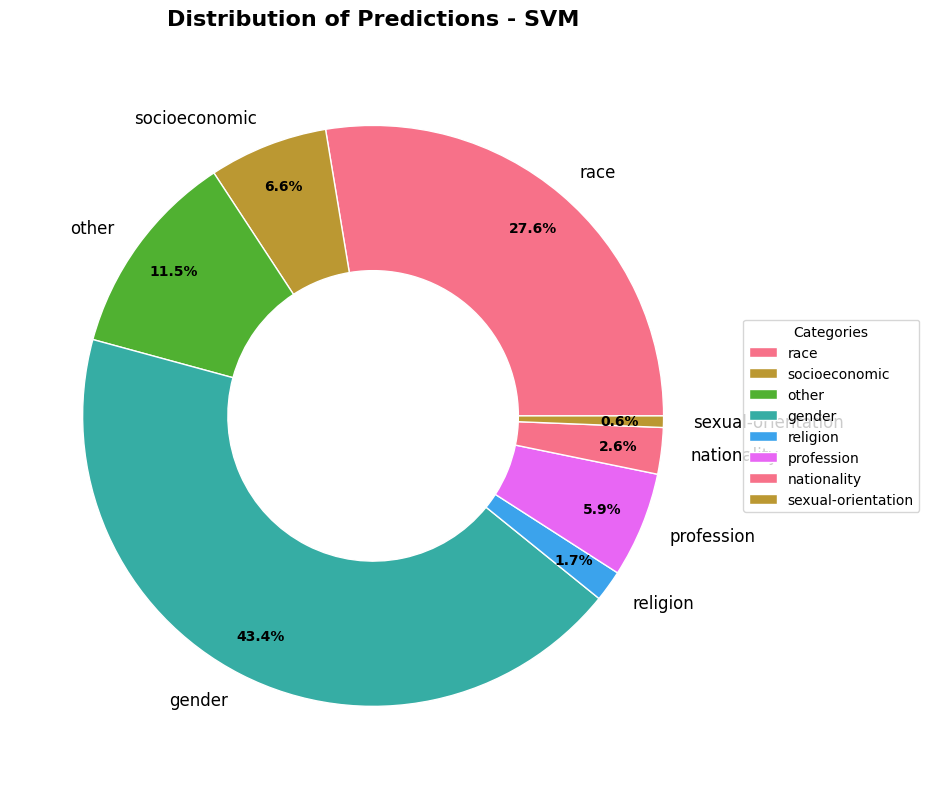
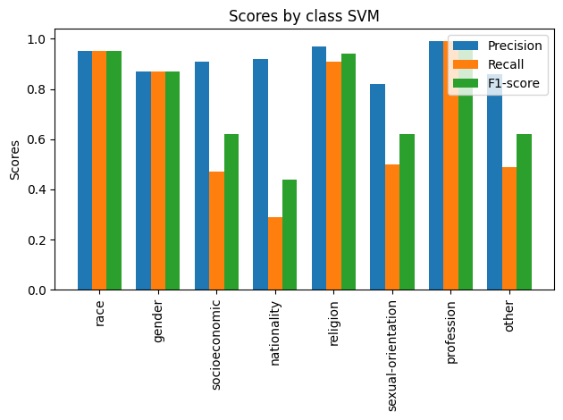

# Implicit Bias in Comedic Scripts

**Question:** which kinds of bias show up in popular comedy films, and how often?
**Approach:** train bias-type classifiers on annotated bias datasets, then apply them to 21 comedy film scripts.
**Result:** a fine-tuned BERT model reached **95.0% accuracy / 94.8% F1** on held-out bias data; applied to the scripts, flagged passages skew heavily toward **gender (~43%)** and **race (~28%)**.

📄 [Full paper](paper.pdf) · 📓 [Notebook](notebooks/nlp_comedies.ipynb)



---

## Data

**Training data** — three public, annotated bias datasets, combined into one 8-class problem (race, gender, socioeconomic, nationality, religion, sexual orientation, profession, other):

- [CrowS-Pairs](https://huggingface.co/datasets/crows_pairs) — sentence pairs annotated for stereotype type
- [StereoSet](https://huggingface.co/datasets/McGill-NLP/stereoset) — gender, profession, race, and religion bias
- [NewsMediaBias](https://huggingface.co/datasets/newsmediabias/news-bias-full-data/blob/main/train.csv) — text labeled for neutrality

**Evaluation data** — 21 comedy film scripts (`data/scripts/`), collected from publicly available sources. Almost no script datasets exist, so the scripts were gathered and cleaned by hand. Because the classifiers were trained on long single sentences rather than short lines of dialogue, scripts are fed to the models as fixed-maximum-length **blocks of text** rather than line by line.

## Models

| Model | Features | Accuracy | F1 (weighted) |
|---|---|---|---|
| SVM | TF-IDF | 92.7% | 92.1% |
| Perceptron | TF-IDF | 91.0% | 90.4% |
| BiLSTM | learned embeddings | 91.1% | 89.4% |
| **BERT (fine-tuned)** | contextual embeddings | **95.0%** | **94.8%** |

All scores are on a held-out split of the combined training datasets.



Performance is strong on well-represented classes (race, gender, profession) and much weaker on sparse ones — nationality and socioeconomic recall drop below 50% for the classical models.

## Limitations

- **The scripts are unlabeled.** Model accuracy is measured on the annotated datasets, not on the scripts, so the script-level results are exploratory rather than validated.
- **Domain shift.** Crowd-sourced stereotype sentences read very differently from film dialogue; irony and satire — the point of many of these films — are invisible to the classifiers.
- **Class imbalance** in the training data carries through to the predictions.

Natural next steps: hand-annotate a sample of script passages to measure real-world precision, and add humor/sarcasm detection upstream of the bias classifier.

## Run it

```bash
git clone https://github.com/beckerchTRJ/nlp-bias-in-comedies.git
cd nlp-bias-in-comedies
pip install -r requirements.txt
jupyter notebook notebooks/nlp_comedies.ipynb
```

The training datasets download from Hugging Face inside the notebook. BERT fine-tuning is far faster with a GPU.

## Repository layout

```plaintext
├── data/scripts/     # 21 comedy film scripts (plain text)
├── notebooks/        # preprocessing, training, and analysis
├── results/          # figures
├── paper.pdf         # full write-up
└── requirements.txt
```

## Credits

Team project at USC. My part was the script pipeline: sourcing the scripts and reshaping dialogue into model-ready text blocks. Teammates: Pia Rodriquez, Frederick Zhang, Rudra Singh, and Ethan Feng.

Thanks to the creators of CrowS-Pairs, StereoSet, and NewsMediaBias. Methods draw on Nadeem and Raz (2022) and the BERT fine-tuning strategies of Sun et al. (2019).
